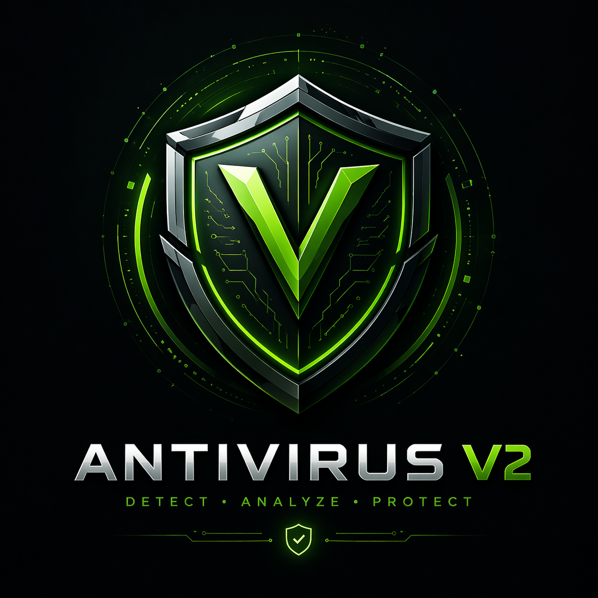

  

<h1 align="center">🛡️ Antivirus v2</h1>

  A modular, Python-powered cybersecurity engine for threat detection, real-time monitoring, and intelligent response.

  
  
  
  
  
  

  

📖 Table of Contents

Overview
Features
Architecture
Requirements
Installation
Usage
Configuration
Module Reference
Contributing
License
Author

🔐 Overview
Antivirus v2 is a lightweight but powerful cybersecurity toolkit built in Python. It combines multiple detection strategies — signature matching, machine learning, and cloud-based lookups — with a real-time file system watcher and a GUI dashboard, giving you layered protection without heavy resource overhead.

Security is not a feature — it is a system.

⚡ Features
FeatureDescription🔍 Signature DetectionHash-based matching against a local signature database🤖 ML ClassificationAnomaly detection via trained machine learning model👁️ Real-Time WatcherMonitors directories for new or modified files instantly🌐 VirusTotal IntegrationCross-checks file hashes against 70+ AV engines via API📊 Web DashboardLive threat log and stats viewable in the browser🖥️ GUI InterfaceDesktop dashboard built with Tkinter📁 Directory ScannerRecursive scanning of entire folder trees🔧 Modular DesignEach component is independently importable and testable

🏗️ Architecture
Antivirus_v2/
│
├── 🧠 Core
│   ├── main.py           # Entry point — wires all components together
│   ├── scanner.py        # File scanning logic
│   ├── analyzer.py       # Threat analysis pipeline
│   ├── ml_detector.py    # Machine learning anomaly detection
│   └── signatures.py     # Signature database management
│
├── 👁️ Monitoring
│   ├── watcher.py        # Real-time filesystem event watcher
│   └── monitor.py        # System-level process monitoring
│
├── 🖥️ Interface
│   ├── gui.py            # Tkinter desktop GUI
│   └── dashboard.py      # Flask web dashboard
│
├── 🔧 Utilities
│   ├── utils.py          # Logging and shared helpers
│   ├── config.py         # Central configuration
│   ├── responder.py      # Automated threat response actions
│   ├── virustotal.py     # VirusTotal API client
│   └── replay.py         # Event replay / forensics helper
│
└── requirements.txt

📋 Requirements

Python 3.8+
A VirusTotal API key (free tier available)
Windows / Linux / macOS

⚙️ Installation
1. Clone the repository
bashgit clone https://github.com/M-2006/Antivirus_v2.git
cd Antivirus_v2
2. Create and activate a virtual environment
bash# Windows
python -m venv venv
venv\Scripts\activate

# macOS / Linux
python -m venv venv
source venv/bin/activate
3. Install dependencies
bashpip install -r requirements.txt
4. Configure your API key
Open config.py and set your VirusTotal API key:
pythonVIRUSTOTAL_API_KEY = "your_api_key_here"

🚀 Usage
Launch the full application (GUI + web dashboard + watcher):
bashpython main.py
The web dashboard will be available at http://localhost:<WEB_DASHBOARD_PORT> (configured in config.py).
Scan a specific directory from the command line:
bashpython dir_scanner.py /path/to/scan

🧪 Example Use Cases

Pre-execution check — Scan a downloaded file before running it
Directory audit — Recursively scan a folder for known malware signatures
Real-time protection — Watch a downloads or temp directory for threats as they arrive
Forensic replay — Use replay.py to re-analyse past events from logs
ML model testing — Feed custom process data into ml_detector.py to evaluate detection accuracy

🔧 Configuration
All settings live in config.py:
pythonWATCH_DIRECTORY   = "/path/to/watch"   # Directory monitored in real time
WEB_DASHBOARD_PORT = 5000              # Port for the Flask dashboard
VIRUSTOTAL_API_KEY = "..."             # Your VirusTotal API key
LOG_LEVEL         = "INFO"             # Logging verbosity
DETECTION_THRESHOLD = 0.75            # ML confidence threshold (0.0 – 1.0)

📦 Module Reference
ModuleResponsibilitymain.pyApplication entry point, bootstraps all threadsscanner.pyHashes files and checks against signaturesanalyzer.pyOrchestrates multi-layered threat analysisml_detector.pyLoads model, extracts features, predicts anomaliessignatures.pyDownloads and updates the signature databasewatcher.pyListens for filesystem events via watchdogmonitor.pyPolls running processes for suspicious behaviourgui.pyTkinter-based desktop interfacedashboard.pyFlask app serving live threat logsvirustotal.pySends SHA-256 hashes to the VirusTotal APIresponder.pyTakes automated action (quarantine, alert, kill)replay.pyReplays stored events for offline analysisutils.pyShared logging and utility functionsconfig.pyCentralised settings and constants

🤝 Contributing
Contributions are welcome! Here's how to get started:

Fork the repository
Create a feature branch: git checkout -b feature/your-feature-name
Commit your changes: git commit -m "Add: your feature description"
Push to your fork: git push origin feature/your-feature-name
Open a Pull Request and describe what you changed and why

Please keep code style consistent and add comments where the logic is non-obvious.

📜 License
This project is licensed under the GNU Affero General Public License v3.0.
You are free to use, modify, and distribute this software under the same licence terms.

👨‍💻 Author
Muhamet Maliqi
GitHub: @M-2006

  Crafted with precision ⚙️ and curiosity 🧠

